# Workshop ITS Robocon

Selamat datang di **Workshop ITS Robocon!**

Modul ini akan membahas tentang ROS2 serta cara mengimplementasikannya di bidang robotika.

## Apa itu ROS2 (Robot Operating System)?

ROS2 (Robot Operating System) adalah framework untuk mengembangkan software robotika. ROS2 memiliki empat fungsi utama yaitu:
1. **Komunikasi antar proses**: Dalam pembuatan sebuah robot pasti akan terjadi komunikasi antara perangkat-perangkatnya. Namun semakin rumit sebuah robot semakin banyak pula komunikasi yang terjadi, maka untuk mempermudah komunikasi tersebut ROS menawarkan solusi berupa beberapa protokol komunikasi yang dapat diterapkan, seperti publisher-subscriber, service, dan action. Dan untuk semakin mempermudah pengembangan robotika ROS juga menyediakan aplikasi untuk memvisualisasikan komunikasi-komunikasi yang terjadi.
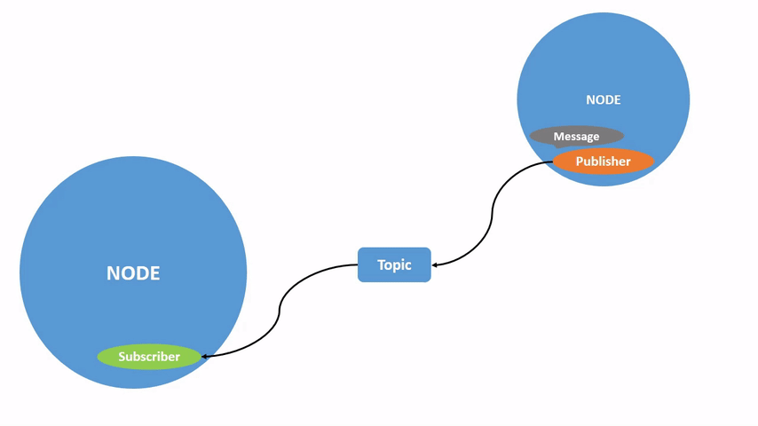
2. **Package management**: Sebelum adanya ROS, pengembangan perangkat lunak untuk robot seringkali bersifat sangat khusus dan tertutup. Setiap institusi cenderung mengembangkan library yang sangat spesifik untuk keperluan mereka, sehingga sulit untuk berbagi dan menggunakan kembali kode yang sudah ada. Hal ini menyebabkan setiap institusi untuk merombak, atau bahkan menulis ulang library yang sebenarnya sudah pernah dibuat. ROS hadir sebagai solusi dengan menyediakan kerangka kerja yang terstandarisasi. Dengan ROS, library perangkat lunak dapat dibagi dan digunakan secara lebih mudah, sehingga mempercepat pengembangan robot dan mendorong inovasi.
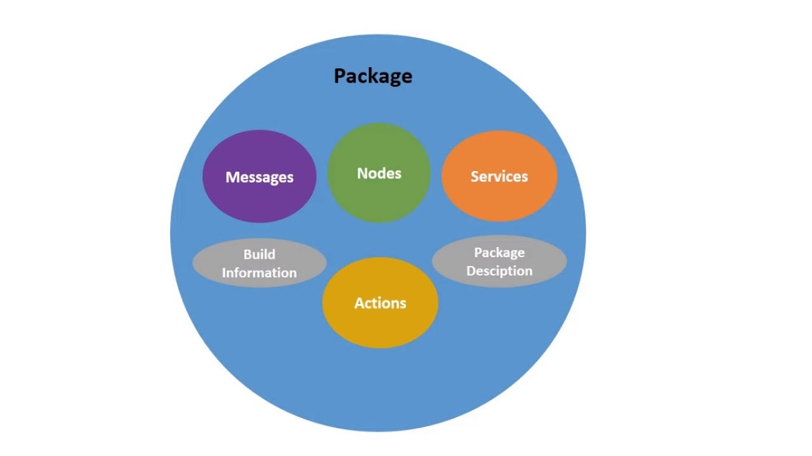
3. **Simulasi**: ROS dapat digunakan dengan [RViZ2](https://docs.ros.org/en/humble/p/rviz2/doc/index.html), [Gazebo](https://gazebosim.org/home) atau [Webots](https://cyberbotics.com/) untuk mensimulasikan robot, mulai dari bagian terkecilnya sampai dengan pergerakannya di suatu latar tempat.
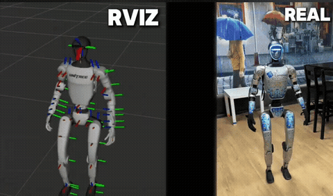

## Konsep Dasar ROS2
Walau namanya *Operating System* ROS2 berbeda dengan *operating system* pada umumnya seperti Windows, Android, MacOS, dsb. ROS2 justru berjalan di atas OS

Karena ROS2 bukanlah OS, ROS2 tetap membutuhkan OS untuk menjalankan program-programnya.

Dalam praktiknya, ROS2 paling umum digunakan pada OS berbasis Linux, khususnya Ubuntu. Oleh karena itu, ketika mengikuti tutorial ROS2, kita akan sering menemukan perintah-perintah yang dijalankan melalui terminal Ubuntu.

Sebagai gambaran sederhana, lingkungan yang kita gunakan dapat dilihat sebagai beberapa lapisan:
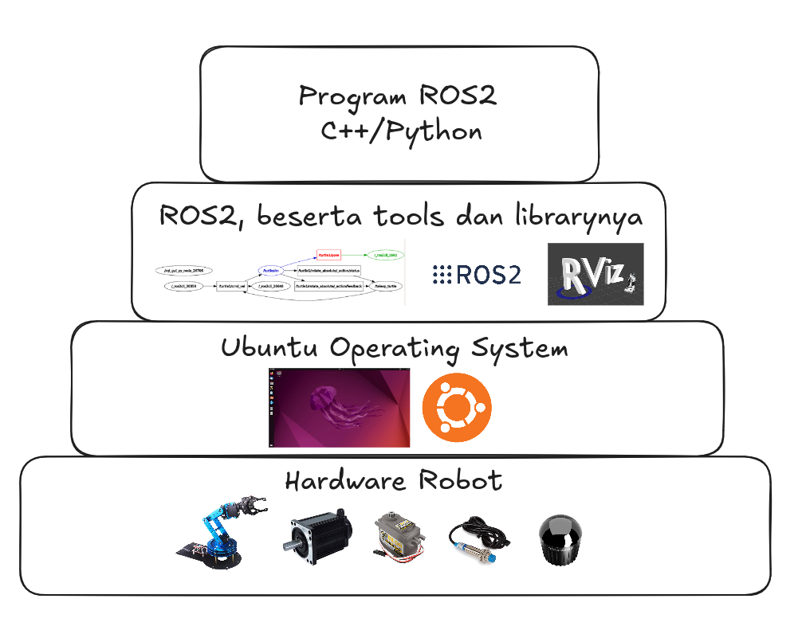
Jadi, ketika kita menjalankan sebuah program ROS2, sebenarnya kita menjalankan program biasa di dalam OS, tetapi program tersebut menggunakan library dan mekanisme yang disediakan oleh ROS2.

## Komponen ROS2
### Node
Node adalah sebuah program yang berjalan menggunakan ROS2, program yang memiliki satu atau beberapa tugas tertentu dalam sistem robot. Sebuah robot biasanya memiliki banyak tugas yang berbeda. Daripada membuat semuanya menjadi satu program besar, kita dapat memisahkannya menjadi beberapa node.

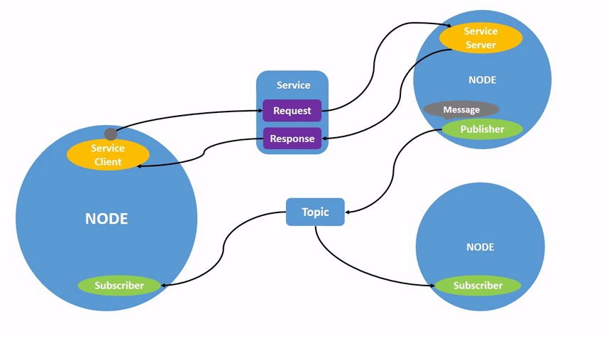

### Topic
Topic adalah jalur komunikasi yang digunakan node untuk mengirim dan menerima data.
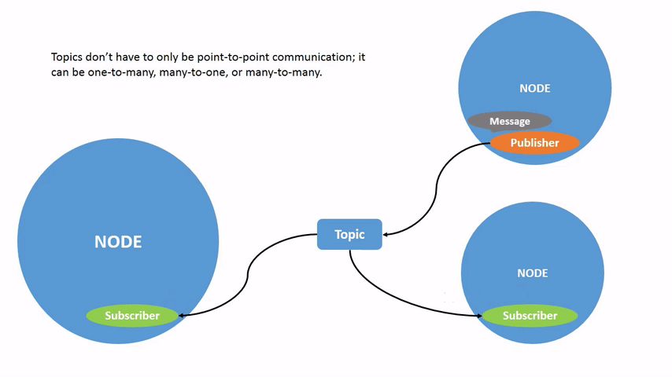
Sebuah node dapat mengirimkan informasi ke saluran tertentu, dan node lain yang mendengarkan saluran tersebut dapat menerima informasi yang dikirimkan.

### Message
Message adalah format data yang dikirimkan melalui topic. Berikut adalah contoh dari format data yang dapat dikirim melalui ROS2:
- msg/Int32
- msg/UInt32
- msg/Float32
- msg/Bool
- msg/String
- msg/ColorRGBA

Semisal kita mau mengirim data dengan suatu format, tapi format tersebut tidak disediakan secara langsung oleh ROS2, kita dapat menentukan format kita sendiri menggunakan [custom interfaces](https://docs.ros.org/en/humble/Tutorials/Beginner-Client-Libraries/Single-Package-Define-And-Use-Interface.html).

## Persiapan sebelum Hands-On
TheConstruct.ai merupakan salah satu cara menjalankan ROS2 tanpa harus melakukan instalasi apapun.

### Membuat Akun di TheConstruct.ai
1. Masuk ke https://www.theconstruct.ai, lalu buat akun dan login.
2. Masuk ke https://app.theconstruct.ai, dan pilih opsi  "My Rosject", lalu pilih "Create a New Rosject"
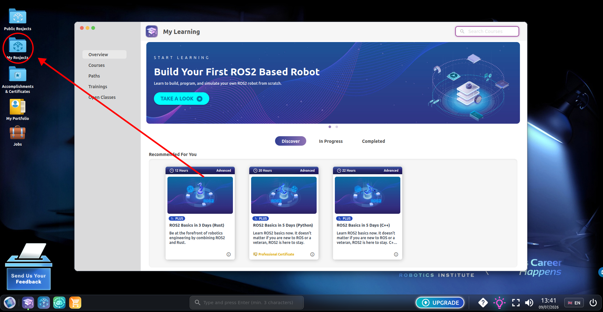
3. Setup Rosject dengan opsi sebagai berikut:
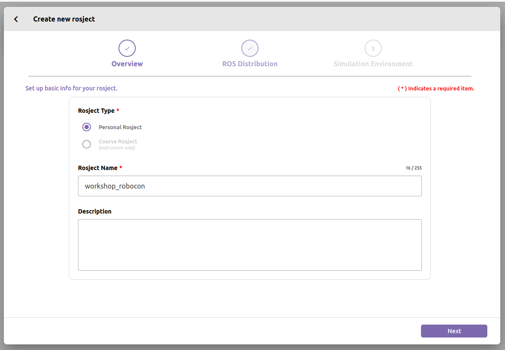
4. Pilih Humble sebagai ROS version-nya:
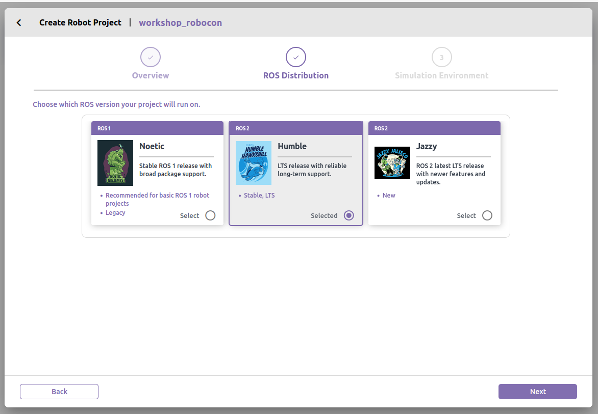
5. Pilih "Empty Simulation" di Simulation Environment:
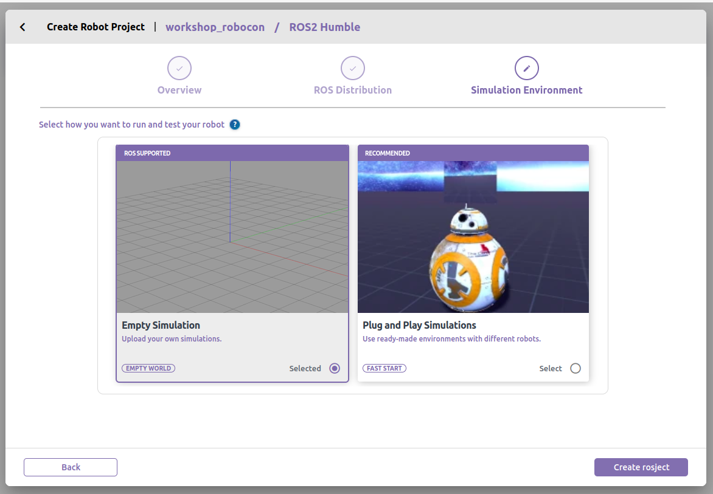
6. Jika sudah selesai, kalian akan disambut dengan tampilan seperti ini:
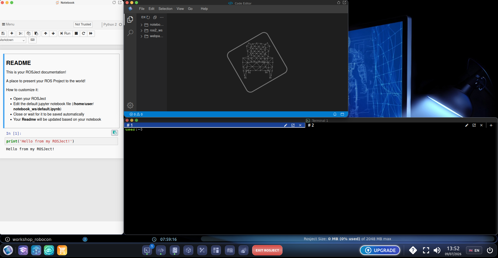
7. Kedepannya, semua contoh kode bisa kalian jalankan di situ.

## Hands-On 1: OOP (Object-Oriented Programming)

### Pengertian OOP
Object-Oriented Programming (OOP) yaitu metode pembuatan program yang berfokus pada `Class` dan `Object`. Bayangkan `Class` itu seperti cetakan kue, dan `Object` adalah kue nyata yang dicetak dari cetakan tersebut.

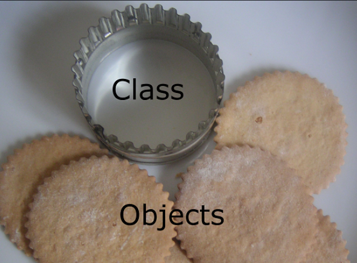

Ketika kamu membuat program dengan konsep OOP, kamu mendesain cetakannya terlebih dahulu, baru kemudian mencetak objeknya untuk digunakan.

### Class & Object
Class adalah cetakan, cetak biru (blueprint), atau definisinya. Class menentukan data apa saja yang dimiliki dan fungsi apa saja yang bisa dijalankan.
1. Atribut (data): variable untuk menyimpan informasi
2. Method (fungsi): aksi yang bisa dilakukan

Pada file `oop_0/class_and_object.cpp`, `Robot` adalah sebuah class. Class tersebut memiliki:
- atribut `name` untuk menyimpan nama robot;
- method `boot()` untuk menyalakan robot; dan
- method `move()` untuk menggerakkan robot.

Class hanya mendefinisikan bentuk dan perilaku umum. Ia belum menjadi robot yang dapat digunakan sebelum dibuat menjadi object.

### Object

Object adalah wujud nyata (instance) yang dicetak dari Class tersebut. Setiap Object memiliki salinan datanya sendiri.

Contohnya, baris berikut membuat object bernama `robotKu` dari class `Robot`:

```cpp
Robot robotKu("Triceratop");
```

Object kemudian dapat memanggil method milik class dengan operator titik (`.`):

```cpp
robotKu.boot();
robotKu.move();
```

Pada `oop_1/inheritance.cpp`, `robot1` dan `robot2` juga merupakan object. Keduanya memiliki tipe class yang berbeda, yaitu `MobileRobot` dan `ArmRobot`.

### Constructor

Constructor adalah method khusus yang akan otomatis dipanggil pertama kali ketika sebuah Object diciptakan di memori. Nama Constructor harus sama persis dengan nama Class-nya. Biasanya digunakan untuk menginisialisasi atau memberikan nilai awal pada atribut Object.

Constructor `Robot` menerima nama robot, kemudian menyimpannya ke atribut `name`:

```cpp
Robot(const std::string &name) { this->name = name; }
```

Parameter `const std::string &name` dikirim sebagai reference agar tidak perlu menyalin string, sedangkan `const` memastikan nilai asal tidak diubah. `this` menunjuk pada object yang sedang dibuat, sehingga `this->name` berarti atribut `name` milik object tersebut.

Constructor class turunan dapat memanggil constructor class induk menggunakan constructor initializer list:

```cpp
MobileRobot(const std::string &name) : Robot(name) {}
```

Dengan begitu, bagian `Robot` dari object `MobileRobot` diinisialisasi melalui constructor `Robot`.

### Encapsulation

Encapsulation adalah penggabungan data dan method dalam satu class sekaligus pengaturan akses terhadap data tersebut. Tujuannya adalah menjaga data agar tidak dapat diubah sembarangan dari luar class.

Pada `class_and_object.cpp`, atribut `name` diberi akses `private`. Artinya, `name` hanya dapat digunakan langsung oleh method di dalam class `Robot`; `main()` tidak dapat mengaksesnya secara langsung. `main()` menggunakan method public seperti `boot()` dan `move()` sebagai antarmuka untuk berinteraksi dengan object.

### Access Modifier (Public, Private, Protected)

Access Modifier adalah penentu hak akses terhadap atribut maupun method yang ada di dalam Class dari luar Class tersebut.

- `public`: Anggota dapat diakses dari mana saja, baik dari dalam Class maupun dari luar Class (seperti di fungsi main()).

- `private`: Anggota hanya bisa diakses oleh internal Class itu sendiri. Pihak luar maupun Class turunan tidak bisa mengaksesnya secara langsung.

- `protected`: Anggota tidak bisa diakses dari luar Class, tetapi BISA diakses oleh Class turunan-nya.

### Inheritance
Inheritance adalah kemampuan sebuah Class untuk mewarisi atribut dan method dari Class lain. Class yang diwarisi disebut class induk, sedangkan class yang mewarisi disebut class turunan.

Pada `oop_1/inheritance.cpp`, `Robot` adalah class induk. `MobileRobot` dan `ArmRobot` adalah class turunan:

```cpp
class MobileRobot : public Robot { ... };
class ArmRobot : public Robot { ... };
```

Keduanya mewarisi method `boot()` dari `Robot`, sehingga method tersebut dapat dipanggil melalui `robot1` dan `robot2`. Keduanya juga memiliki perilaku `move()` masing-masing.

Inheritance membantu menggunakan kembali kode yang sama. Informasi dan perilaku umum robot diletakkan di `Robot`, sedangkan perilaku khusus diletakkan di class turunannya.

Pada contoh ini, atribut `name` diubah dari `private` menjadi `protected`. Dengan demikian, `name` tetap tidak dapat diakses langsung dari `main()`, tetapi dapat digunakan oleh class turunan untuk menampilkan nama robot.

### Polymorphism & Overriding
Polymorphism (banyak bentuk) memungkinkan Class anak untuk mengubah atau memperbarui perilaku dari fungsi yang diturunkan oleh Class induk.

- `virtual`: Ditulis pada fungsi di Class Induk untuk memberi izin ke Class Anak agar fungsinya boleh diubah.

- `override`: Ditulis pada fungsi di Class Anak untuk menegaskan bahwa fungsi tersebut menggantikan logika milik Class Induk.

Pada contoh ini, `Robot::move()` ditandai sebagai `virtual`, lalu digantikan oleh implementasi berikut:

```cpp
void move() override { cout << name << " bergerak dengan sangat cepat\n"; }
```

di `MobileRobot`, dan:

```cpp
void move() override { cout << name << " bergerak dan mengambil box\n"; }
```

di `ArmRobot`. Akibatnya, setiap jenis robot dapat memiliki cara bergerak yang berbeda meskipun method-nya bernama sama.

`virtual` akan lebih terlihat manfaatnya ketika object turunan diakses melalui reference atau pointer bertipe class induk. C++ kemudian memilih implementasi `move()` sesuai object sebenarnya. Pemilihan perilaku saat program berjalan ini disebut dynamic dispatch.

## Hands-On 1: Menggunakan ROS2 CLI dengan Demo Publisher dan Subscriber

Kita bisa mulai belajar bagaimana cara berinteraksi dengan sistem ROS2 melalui terminal. ROS2 menyediakan command-line tools yang sangat berguna untuk melihat node, topic, message, dan komunikasi antar proses. Salah satu cara paling sederhana untuk mempelajarinya adalah dengan menggunakan node demo bawaan ROS2, yaitu publisher dan subscriber.

### Persiapan awal

Pastikan ROS2 sudah disource pada terminal yang akan kalian gunakan:

```bash
source /opt/ros/humble/setup.bash
```

### 1. Menjalankan demo publisher

Buka terminal baru, lalu jalankan node publisher demo:

```bash
ros2 run demo_nodes_cpp talker
```

Perintah di atas akan menjalankan node `talker` yang secara terus-menerus mengirim data ke topic `/chatter`. Data yang dikirim biasanya berupa string dengan format `std_msgs/msg/String`.

### 2. Menjalankan demo subscriber

Buka terminal kedua, lalu jalankan node subscriber demo:

```bash
ros2 run demo_nodes_cpp listener
```

Setelah listener aktif, node tersebut akan menerima data yang dikirim oleh `talker` dan menampilkan isinya di terminal.

### 3. Melihat node yang sedang aktif

Untuk melihat semua node yang sedang berjalan, jalankan:

```bash
ros2 node list
```

Kalian akan melihat node seperti `/talker` dan `/listener`. Ini menunjukkan bahwa kedua node sudah terhubung dan bekerja dalam satu sistem ROS2.

### 4. Melihat topic yang tersedia

Perintah berikut akan menampilkan semua topic yang sedang aktif di sistem:

```bash
ros2 topic list
```

Jika kalian menjalankan demo talker-listener, maka biasanya akan muncul topic `/chatter`.

### 5. Melihat informasi topic

Untuk melihat publisher, subscriber, dan tipe data dari suatu topic, gunakan:

```bash
ros2 topic info /chatter
```

Perintah ini akan menunjukkan bahwa `/chatter` memiliki publisher dan subscriber, serta tipe message yang dipakai.

### 6. Menampilkan data yang dikirim pada topic

Untuk melihat isi pesan yang dikirim secara real-time oleh publisher, jalankan:

```bash
ros2 topic echo /chatter
```

Kalian akan melihat output seperti text yang terus berubah, misalnya `data: "Hello World"` atau format yang serupa. Ini adalah cara paling sederhana untuk memantau komunikasi antar node.

### 7. Melihat frekuensi publish

Jika ingin melihat seberapa sering data dipublish ke topic tertentu, gunakan:

```bash
ros2 topic hz /chatter
```

Perintah ini menampilkan nilai frekuensi dalam satuan Hz. Dengan cara ini, kalian bisa mengetahui apakah publisher mengirim data dengan kecepatan yang stabil.

### 8. Mengecek tipe message

Untuk melihat tipe message yang digunakan oleh topic, jalankan:

```bash
ros2 topic type /chatter
```

Hasilnya biasanya menunjukkan bahwa topic `/chatter` menggunakan tipe message:

```bash
std_msgs/msg/String
```

Kalian juga bisa menampilkan definisi message tersebut dengan perintah:

```bash
ros2 interface show std_msgs/msg/String
```

Ini akan menampilkan struktur data dari message `String`, misalnya field `data`.

### 9. Menampilkan topic bersama tipe datanya

Untuk melihat daftar topic lengkap dengan tipe message, gunakan:

```bash
ros2 topic list -t
```

Flag `-t` akan menampilkan tipe data pada setiap topic, sehingga lebih mudah untuk memahami komunikasi yang terjadi dalam sistem.

### Kesimpulan

Dengan demo `talker` dan `listener`, peserta dapat melihat langsung bagaimana ROS2 bekerja:

- `talker` bertindak sebagai publisher;
- `listener` bertindak sebagai subscriber;
- `/chatter` adalah topic tempat data dikirim;
- `ros2 topic` dan `ros2 node` memungkinkan kita memantau dan memahami aliran komunikasi di sistem ROS2.

Praktik ini menjadi dasar penting sebelum beralih ke pembuatan node sendiri, baik untuk sensor, kontrol robot, maupun komunikasi antar modul robot.


# Hands-On 2: ROS2 Publisher & Subscriber

Pada hands-on kedua, kita akan membuat dua node ROS2:

```text
Publisher Node
      │
      │ String
      ▼
  /chatter
      │
      ▼
Subscriber Node
```

Publisher akan mengirim pesan `"Hello ROS2!"` secara berkala melalui topic `/chatter`.

Subscriber akan menerima pesan tersebut dan menampilkannya di terminal.

---

## 1. Membuat Workspace

Buat workspace dan folder `src`:

```bash
mkdir -p ~/ros2_chat_ws/src
cd ~/ros2_chat_ws
```

---

## 2. Membuat Package

Masuk ke folder `src` dan buat package:

```bash
cd ~/ros2_chat_ws/src

ros2 pkg create ros2_chat \
    --build-type ament_cmake \
    --dependencies rclcpp std_msgs
```

Kemudian masuk ke package:

```bash
cd ~/ros2_chat_ws/src/ros2_chat
```

---

## 3. Membuat Publisher

Buat file Publisher:

```bash
touch src/publisher.cpp
```

Buka `src/publisher.cpp` dan masukkan program berikut:

```cpp
#include <chrono>
#include <memory>

#include "rclcpp/rclcpp.hpp"
#include "std_msgs/msg/string.hpp"

using namespace std::chrono_literals;

class ChatPublisher : public rclcpp::Node
{
public:
    ChatPublisher()
        : Node("chat_publisher")
    {
        publisher_ = create_publisher<std_msgs::msg::String>(
            "/chatter",
            10
        );

        timer_ = create_wall_timer(
            1s,
            std::bind(&ChatPublisher::publish_message, this)
        );
    }

private:
    void publish_message()
    {
        auto message = std_msgs::msg::String();
        message.data = "Hello ROS2!";

        publisher_->publish(message);

        RCLCPP_INFO(
            get_logger(),
            "Publishing: %s",
            message.data.c_str()
        );
    }

    rclcpp::Publisher<std_msgs::msg::String>::SharedPtr publisher_;
    rclcpp::TimerBase::SharedPtr timer_;
};

int main(int argc, char * argv[])
{
    rclcpp::init(argc, argv);

    auto node = std::make_shared<ChatPublisher>();

    rclcpp::spin(node);

    rclcpp::shutdown();

    return 0;
}
```

Program tersebut membuat sebuah node bernama `chat_publisher`.

Node tersebut memiliki Publisher yang mengirim message bertipe:

```text
std_msgs/msg/String
```

ke topic:

```text
/chatter
```

---

## 4. Membuat Subscriber

Buat file Subscriber:

```bash
touch src/subscriber.cpp
```

Buka `src/subscriber.cpp` dan masukkan program berikut:

```cpp
#include <memory>

#include "rclcpp/rclcpp.hpp"
#include "std_msgs/msg/string.hpp"

class ChatSubscriber : public rclcpp::Node
{
public:
    ChatSubscriber()
        : Node("chat_subscriber")
    {
        subscription_ = create_subscription<std_msgs::msg::String>(
            "/chatter",
            10,
            std::bind(
                &ChatSubscriber::receive_message,
                this,
                std::placeholders::_1
            )
        );
    }

private:
    void receive_message(
        const std_msgs::msg::String::SharedPtr message
    )
    {
        RCLCPP_INFO(
            get_logger(),
            "Received: %s",
            message->data.c_str()
        );
    }

    rclcpp::Subscription<std_msgs::msg::String>::SharedPtr subscription_;
};

int main(int argc, char * argv[])
{
    rclcpp::init(argc, argv);

    auto node = std::make_shared<ChatSubscriber>();

    rclcpp::spin(node);

    rclcpp::shutdown();

    return 0;
}
```

Program tersebut membuat node bernama `chat_subscriber`.

Node tersebut memiliki Subscriber yang menerima message bertipe:

```text
std_msgs/msg/String
```

dari topic:

```text
/chatter
```

---

## 5. Mengatur CMake

Sekarang kita perlu memberi tahu CMake bahwa terdapat dua program yang ingin kita build.

Buka:

```bash
nano CMakeLists.txt
```

Ganti isinya menjadi:

```cmake
cmake_minimum_required(VERSION 3.8)

project(ros2_chat)

if(NOT CMAKE_CXX_STANDARD)
  set(CMAKE_CXX_STANDARD 17)
endif()

find_package(ament_cmake REQUIRED)
find_package(rclcpp REQUIRED)
find_package(std_msgs REQUIRED)

add_executable(publisher src/publisher.cpp)
ament_target_dependencies(publisher rclcpp std_msgs)

add_executable(subscriber src/subscriber.cpp)
ament_target_dependencies(subscriber rclcpp std_msgs)

install(
  TARGETS
    publisher
    subscriber
  DESTINATION lib/${PROJECT_NAME}
)

ament_package()
```

Simpan file tersebut.

---

## 6. Build Workspace

Kembali ke workspace:

```bash
cd ~/ros2_chat_ws
```

Kemudian build:

```bash
colcon build
```

Jika berhasil, akan muncul folder:

```text
ros2_chat_ws/
├── build/
├── install/
├── log/
└── src/
```

---

## 7. Source Workspace

Setelah build selesai, kita perlu memberitahu terminal mengenai package yang baru saja dibuat:

```bash
source install/setup.bash
```

Sekarang package `ros2_chat` sudah dapat digunakan oleh ROS2.

---

## 8. Menjalankan Publisher

Buka terminal pertama.

Source ROS2:

```bash
source /opt/ros/humble/setup.bash
```

Kemudian source workspace:

```bash
source ~/ros2_chat_ws/install/setup.bash
```

Jalankan Publisher:

```bash
ros2 run ros2_chat publisher
```

Jika berhasil, terminal akan menampilkan:

```text
[INFO] [...] [chat_publisher]: Publishing: Hello ROS2!
[INFO] [...] [chat_publisher]: Publishing: Hello ROS2!
[INFO] [...] [chat_publisher]: Publishing: Hello ROS2!
```

Publisher sekarang mengirim message setiap satu detik.

---

## 9. Menjalankan Subscriber

Buka **terminal kedua**.

Source ROS2:

```bash
source /opt/ros/humble/setup.bash
```

Source workspace:

```bash
source ~/ros2_chat_ws/install/setup.bash
```

Jalankan Subscriber:

```bash
ros2 run ros2_chat subscriber
```

Jika berhasil, terminal akan menampilkan:

```text
[INFO] [...] [chat_subscriber]: Received: Hello ROS2!
[INFO] [...] [chat_subscriber]: Received: Hello ROS2!
[INFO] [...] [chat_subscriber]: Received: Hello ROS2!
```

Sekarang kedua node sudah berkomunikasi melalui topic `/chatter`.

---

## 10. Melihat Node yang Berjalan

Biarkan Publisher dan Subscriber tetap berjalan.

Buka **terminal ketiga**:

```bash
source /opt/ros/humble/setup.bash
source ~/ros2_chat_ws/install/setup.bash
```

Kemudian jalankan:

```bash
ros2 node list
```

Akan muncul:

```text
/chat_publisher
/chat_subscriber
```

Ini menunjukkan bahwa terdapat dua node yang sedang berjalan.

---

## 11. Melihat Topic

Jalankan:

```bash
ros2 topic list
```

Akan muncul:

```text
/chatter
```

Topic `/chatter` merupakan jalur komunikasi yang digunakan oleh kedua node.

---

## 12. Melihat Informasi Topic

Jalankan:

```bash
ros2 topic info /chatter
```

Perhatikan jumlah Publisher dan Subscriber yang terhubung dengan topic tersebut.

Kita seharusnya mendapatkan:

```text
Publisher count: 1
Subscription count: 1
```

---

## 13. Melihat Message

ROS2 juga menyediakan command untuk melihat message yang sedang dikirim melalui sebuah topic.

Jalankan:

```bash
ros2 topic echo /chatter
```

Kita akan melihat:

```text
data: Hello ROS2!
---
data: Hello ROS2!
---
data: Hello ROS2!
---
```

Pada tahap ini, kita bahkan tidak perlu membuat Subscriber sendiri untuk melihat data yang dikirim Publisher.

---

# Hasil Akhir

Kita sekarang memiliki dua node:

```text
┌─────────────────────┐
│   chat_publisher    │
│                     │
│     Publisher       │
└──────────┬──────────┘
           │
           │ std_msgs/msg/String
           │
           ▼
       /chatter
           │
           │
           ▼
┌─────────────────────┐
│   chat_subscriber   │
│                     │
│     Subscriber      │
└─────────────────────┘
```

Publisher bertugas **mengirim** message, sedangkan Subscriber bertugas **menerima** message.

Keduanya tidak berkomunikasi secara langsung. Publisher mengirim message melalui topic `/chatter`, kemudian Subscriber menerima message dari topic tersebut.


# Hands-On 3: Menggerakkan Turtlesim dengan Publisher

Pada hands-on sebelumnya, kita membuat Publisher dan Subscriber yang berkomunikasi melalui topic.

Sekarang kita akan menggunakan konsep Publisher yang sama untuk berkomunikasi dengan node yang **sudah dibuat oleh ROS2**, yaitu `turtlesim`.

Kita akan membuat turtle bergerak membentuk lingkaran.

Secara sederhana, komunikasinya adalah:

```text
┌─────────────────────┐
│   circle_publisher  │
│                     │
│     Publisher       │
└──────────┬──────────┘
           │
           │ Twist
           ▼
 /turtle1/cmd_vel
           │
           ▼
┌─────────────────────┐
│      turtlesim      │
│                     │
│     Subscriber      │
└──────────┬──────────┘
           │
           ▼
          🐢
```

Perhatikan bahwa kali ini kita **tidak membuat Subscriber sendiri**. Node `turtlesim` sudah memiliki Subscriber yang menerima command untuk menggerakkan turtle.

---

## 1. Menjalankan Turtlesim

Sebelum membuat Publisher, kita perlu menjalankan `turtlesim` terlebih dahulu. `turtlesim` adalah node bawaan ROS2 yang sudah memiliki subscriber pada topic `/turtle1/cmd_vel`, jadi ia siap menerima perintah gerak dari publisher kita.

Buka terminal pertama dan jalankan:

```bash
source /opt/ros/humble/setup.bash
ros2 run turtlesim turtlesim_node
```

Sebuah jendela `turtlesim` akan muncul dengan seekor turtle di dalamnya.

Biarkan terminal ini tetap berjalan. Jika ingin melihat turtle bergerak, jangan menutup terminal tersebut.

> Catatan: `turtlesim` akan menerima perintah gerak melalui topic `/turtle1/cmd_vel`, jadi topic ini harus sesuai dengan nama turtle default, yaitu `turtle1`.

---

## 2. Membuat Workspace

Buka terminal kedua.

Buat workspace:

```bash
mkdir -p ~/ros2_turtlesim_ws/src
cd ~/ros2_turtlesim_ws
```

---

## 3. Membuat Package

Masuk ke folder `src`:

```bash 
cd ~/ros2_turtlesim_ws/src
```

Kemudian buat package:

```bash 
ros2 pkg create ros2_turtlesim \
    --build-type ament_cmake \
    --dependencies rclcpp geometry_msgs
```

Masuk ke package:

```bash 
cd ~/ros2_turtlesim_ws/src/ros2_turtlesim
```

---

## 4. Membuat Publisher

Buat file:

```bash
touch src/circle_publisher.cpp
```

Buka file tersebut dan masukkan:

```cpp
#include <chrono>
#include <memory>

#include "rclcpp/rclcpp.hpp"
#include "geometry_msgs/msg/twist.hpp"

using namespace std::chrono_literals;

class CirclePublisher : public rclcpp::Node
{
public:
    CirclePublisher()
        : Node("circle_publisher")
    {
        publisher_ = create_publisher<geometry_msgs::msg::Twist>(
            "/turtle1/cmd_vel",
            10
        );

        timer_ = create_wall_timer(
            100ms,
            std::bind(&CirclePublisher::publish_velocity, this)
        );
    }

private:
    void publish_velocity()
    {
        auto message = geometry_msgs::msg::Twist();

        message.linear.x = 2.0;
        message.angular.z = 1.5;

        publisher_->publish(message);

        RCLCPP_INFO(
            get_logger(),
            "Publishing cmd_vel: linear.x=%.2f, angular.z=%.2f",
            message.linear.x,
            message.angular.z
        );
    }

    rclcpp::Publisher<geometry_msgs::msg::Twist>::SharedPtr publisher_;
    rclcpp::TimerBase::SharedPtr timer_;
};

int main(int argc, char * argv[])
{
    rclcpp::init(argc, argv);

    auto node = std::make_shared<CirclePublisher>();

    rclcpp::spin(node);

    rclcpp::shutdown();

    return 0;
}
```

Perhatikan bagian berikut:

```cpp
message.linear.x = 2.0;
message.angular.z = 1.5;
```

Kita memberikan nilai pada:

```text
linear.x
angular.z
```

Sedangkan komponen lainnya tetap `0`.

Artinya turtle akan:

* bergerak maju dengan kecepatan linear `2.0`
* berputar dengan kecepatan angular `1.5`

Kombinasi ini membuat turtle bergerak membentuk lintasan melingkar yang jelas dan mudah terlihat di window `turtlesim`.

---

## 5. Mengatur CMake

Buka `CMakeLists.txt`:

```bash 
nano CMakeLists.txt
```

Ganti isinya menjadi:

```cmake 
cmake_minimum_required(VERSION 3.8)

project(ros2_turtlesim)

if(NOT CMAKE_CXX_STANDARD)
  set(CMAKE_CXX_STANDARD 17)
endif()

find_package(ament_cmake REQUIRED)
find_package(rclcpp REQUIRED)
find_package(geometry_msgs REQUIRED)

add_executable(circle_publisher src/circle_publisher.cpp)

ament_target_dependencies(
  circle_publisher
  rclcpp
  geometry_msgs
)

install(
  TARGETS
    circle_publisher
  DESTINATION lib/${PROJECT_NAME}
)

ament_package()
```

Simpan file tersebut.

---

## 6. Build Workspace

Kembali ke workspace:

```bash 
cd ~/ros2_turtlesim_ws
```

Build:

```bash 
colcon build
```

Jika berhasil, akan muncul:

```text 
ros2_turtlesim_ws/
├── build/
├── install/
├── log/
└── src/
```

---

## 7. Source Workspace

Setelah build selesai:

```bash 
source install/setup.bash
```

---

## 8. Menjalankan Publisher

Pastikan `turtlesim` masih berjalan di terminal pertama.

Buka terminal kedua, lalu jalankan:

```bash
source /opt/ros/humble/setup.bash
source ~/ros2_turtlesim_ws/install/setup.bash
ros2 run ros2_turtlesim circle_publisher
```

Setelah perintah itu dijalankan, turtle di jendela `turtlesim` akan mulai bergerak membentuk lingkaran.

Jika turtle tidak bergerak, kemungkinan penyebabnya adalah:

- `turtlesim` belum dijalankan;
- topic yang dipublish salah, harus `/turtle1/cmd_vel`;
- workspace belum di-source dengan benar;
- nama package atau executable tidak sesuai.

Untuk mengecek apakah topic sudah benar, jalankan di terminal lain:

```bash
source /opt/ros/humble/setup.bash
ros2 topic list
ros2 topic info /turtle1/cmd_vel
ros2 topic echo /turtle1/cmd_vel
```

Jika berhasil, kalian akan melihat data `Twist` yang dikirimkan dan dapat memastikan publisher sudah terhubung dengan subscriber `turtlesim`.

---

# Memahami Apa yang Terjadi

Pada hands-on sebelumnya, kita memiliki:

```text 
Publisher
    │
    ▼
/chatter
    │
    ▼
Subscriber
```

Sekarang kita memiliki:

```text 
Publisher
    │
    ▼
/turtle1/cmd_vel
    │
    ▼
turtlesim
```

Perbedaannya adalah **Subscriber-nya sudah dibuat oleh `turtlesim`**.

Publisher yang kita buat mengirimkan message:

```text 
geometry_msgs/msg/Twist
```

ke:

```text 
/turtle1/cmd_vel
```

`turtlesim` kemudian menerima message tersebut dan menggunakannya untuk menentukan pergerakan turtle.

---

## 9. Melihat Topic yang Digunakan

Buka terminal lain:

```bash 
source /opt/ros/humble/setup.bash
```

Kemudian:

```bash 
ros2 topic list
```

Kita dapat melihat topic:

```text 
/turtle1/cmd_vel
```

---

## 10. Melihat Informasi Topic

Jalankan:

```bash 
ros2 topic info /turtle1/cmd_vel
```

Kita dapat melihat bahwa terdapat:

```text 
Publisher count: 1
Subscription count: 1
```

Publisher tersebut adalah node yang baru saja kita buat, sedangkan Subscriber-nya adalah `turtlesim`.

---

## 11. Melihat Message yang Dikirim

Kita juga dapat melihat message yang dikirim ke turtlesim:

```bash 
ros2 topic echo /turtle1/cmd_vel
```

Kita akan melihat nilai seperti:

```text
linear:
  x: 2.0
  y: 0.0
  z: 0.0
angular:
  x: 0.0
  y: 0.0
  z: 1.5
```

Perhatikan bahwa hanya `linear.x` dan `angular.z` yang kita berikan nilai.

---

# Kesimpulan

Pada hands-on ini, kita membuat sebuah Publisher yang mengirimkan command velocity kepada `turtlesim`.

```text 
circle_publisher
       │
       │ Publisher
       ▼
/turtle1/cmd_vel
       │
       │ geometry_msgs/msg/Twist
       ▼
   turtlesim
       │
       │ Subscriber
       ▼
    🐢 bergerak
```

Kita tidak perlu membuat Subscriber untuk menerima command tersebut karena **`turtlesim` sudah menyediakan Subscriber-nya sendiri**.

Hal ini menunjukkan salah satu keuntungan utama ROS2:

> Kita dapat membuat satu node yang melakukan suatu tugas dan berkomunikasi dengan node lain tanpa harus mengetahui bagaimana node tersebut diimplementasikan.

Pada contoh ini, program kita hanya perlu mengetahui bahwa `/turtle1/cmd_vel` menerima message bertipe `geometry_msgs/msg/Twist`.

Bagaimana `turtlesim` memproses message tersebut untuk menggerakkan turtle merupakan tanggung jawab dari `turtlesim`.
